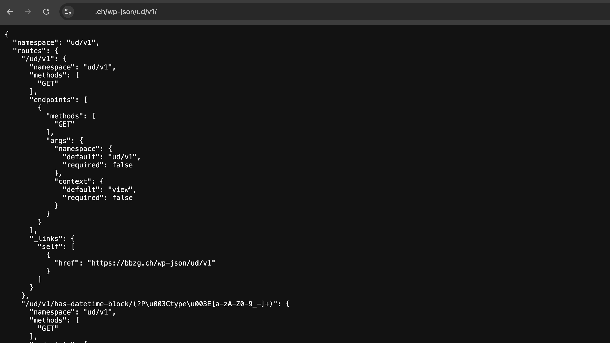

# UD Plugin: Shared API

Zentrale Schnittstellen-Erweiterung.
Das Plugin bündelt und erweitert REST-Endpunkte, um den Datenaustausch zwischen verschiedenen Custom Post Types, Blöcken und externen Anwendungen zu vereinheitlichen.

## Funktionen

- **Zentrale REST-API-Erweiterung**
  - Registriert eigene Namespaces und Endpunkte unter `/wp-json/ud/v1/`
  - Liefert strukturierte Daten für Frontend-Blöcke, Filter oder externe Systeme

- **Tag-basierte Abfragen**
  - Endpunkte zur Abfrage von Beiträgen nach Schlagwörtern oder Taxonomien
  - Einfache Integration für Blöcke wie `ud-tagged-links-block` oder `ud-personal-card-filter-container`

- **Admin-Filter**
  - Erweiterung des WordPress-Backends um Filteroptionen (z. B. nach Tags oder CPTs)
  - Verbesserung der Redaktionsübersicht bei umfangreichen Inhalten

- **Wiederverwendbare API-Helfer**
  - `ud-shared-api.php` stellt zentrale Funktionen zur Verfügung (z. B. JSON-Formatierung, Security Checks)
  - Gemeinsame Nutzung in mehreren UD-Plugins (z. B. „Messstation“, „Tagged Links“, „Personal Cards“)

*Die Einträge der Shared-Api können über /wp-json/ud/v1/ aufgerufen werden.*

## Technische Details

- **Namespace:** `ud/v1`
- **REST-Basis:** `/wp-json/ud/v1/`
- Unterstützt Abfragen nach:
  - Custom Post Types (CPT)
  - Tags / Taxonomien
  - Meta-Feldern oder Kombinationen davon
- JSON-Ausgabe für direkte Nutzung in Frontend-Blöcken
- Vollständig kompatibel mit WordPress REST-API-Sicherheitsmodell

## Autor

[ulrich.digital gmbh](https://ulrich.digital)

## Lizenz

GPL v2 or later
[https://www.gnu.org/licenses/gpl-2.0.html](https://www.gnu.org/licenses/gpl-2.0.html)

